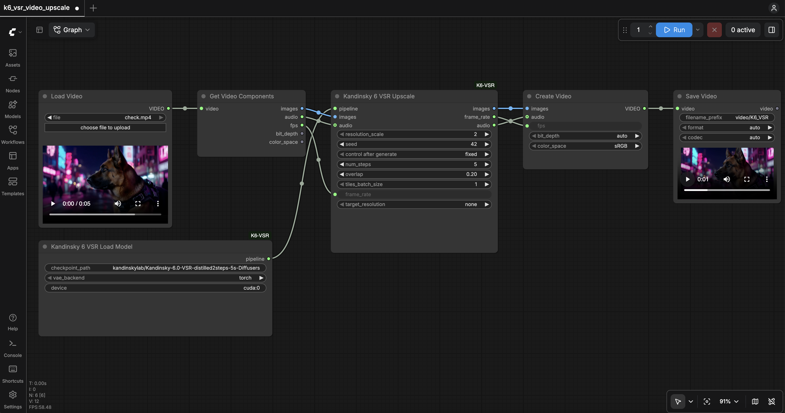

# ComfyUI-K6-VSR

ComfyUI custom nodes for **Kandinsky 6.0 Video Super-Resolution**: tiled x2 / x2.25 / x4 upscaling of 5-second clips with the [Kandinsky-6.0-VSR](https://huggingface.co/kandinskylab/Kandinsky-6.0-VSR-distilled2steps-5s-Diffusers) models — the SR DiT, the KVAE video tokenizer and the x2 / x4 latent upscalers, all in one Diffusers bundle. The nodes are a thin adapter over the [`kandinsky-6-sr`](../README.md) package — the same pipeline the `kandy-sr` CLI runs.

<div align="center">

</div>

## Nodes

| Node | Inputs | Outputs |
|---|---|---|
| **Kandinsky 6 VSR Load Model** | `checkpoint_path` (the Diffusers bundle, a Hugging Face repo id by default), `vae_backend` (`torch` / `magi`), `device` | `pipeline` (`K6_VSR_PIPELINE`) |
| **Kandinsky 6 VSR Upscale** | `pipeline`, `images` (video frames as one `IMAGE` batch), `resolution_scale` (`2` / `2.25` / `4`), `seed`, `num_steps` (flow-matching checkpoint only), `overlap`, `tiles_batch_size`, `frame_rate` (fps of the input frames), `target_resolution` (`none` / `hd` / `fullhd` / `2k`), optional `audio` | `images` (SR frames), `frame_rate` (fps to encode them at), `audio` (the optional `audio` input, cut to the SR clip) |

Both nodes live under `video/upscaling/Kandinsky 6 VSR`. The loader's output is cached by ComfyUI, so the models stay on the GPU between runs as long as the loader inputs do not change. Every parameter has the same meaning as in the [config reference](../README.md#config-parameters-sr-section) of the package. `num_steps` only matters for the flow-matching `Kandinsky-6.0-VSR-5s` checkpoint; the distilled one always runs its trained 2 steps.

`checkpoint_path` names a Diffusers bundle — [`kandinskylab/Kandinsky-6.0-VSR-distilled2steps-5s-Diffusers`](https://huggingface.co/kandinskylab/Kandinsky-6.0-VSR-distilled2steps-5s-Diffusers) (2-step distilled, the default) or [`kandinskylab/Kandinsky-6.0-VSR-5s-Diffusers`](https://huggingface.co/kandinskylab/Kandinsky-6.0-VSR-5s-Diffusers) (flow matching) — and the DiT, the KVAE and the latent upscalers all load from it automatically, using the same resolution as the CLI. Only `checkpoint_path` is needed to select the models: a Hugging Face repo id (downloaded into the HF cache on first use), an absolute local path to a bundle, or a bundle name under `ComfyUI/models/kandinsky_vsr/`.

Existing workflows with separate VAE and latent-upscaler widgets migrate automatically when opened: the saved backend and device are preserved, and empty values default to `torch` and `cuda:0`.

## Installation

Requirements: Python >= 3.12 and torch >= 2.10 in ComfyUI's environment, and a CUDA GPU large enough for the SR DiT, the KVAE and the latent upscaler together (tested on H100).

1. **Install ComfyUI** into a Python environment that already has the torch build you want (the [kandinsky-6-sr](../README.md#-getting-started) setup gives torch 2.10 / CUDA 12.8). ComfyUI requires `torchaudio`, and its version must match the installed torch exactly, so install it first from the same index (otherwise ComfyUI's requirements pull the newest torchaudio and upgrade torch with it):

   ```bash
   pip install torchaudio==2.10.0 --index-url https://download.pytorch.org/whl/cu128   # torchaudio == your torch version
   git clone https://github.com/comfyanonymous/ComfyUI.git
   cd ComfyUI
   pip install -r requirements.txt
   python -c "import torch; print(torch.__version__)"   # still your torch build
   ```

2. **Install the SR package** (add `[magi]` for the MagiCompiler KVAE backend):

   ```bash
   pip install "kandinsky-6-sr @ git+https://github.com/kandinskylab/kandinsky-6-sr"
   ```

3. **Link this folder into `custom_nodes/`.** It ships inside the `kandinsky-6-sr` repository, so clone it once and link the subfolder with an absolute path (a relative link that does not resolve makes ComfyUI skip the pack):

   ```bash
   cd /path/to/ComfyUI/custom_nodes
   git clone --depth 1 https://github.com/kandinskylab/kandinsky-6-sr.git
   ln -s "$(pwd)/kandinsky-6-sr/ComfyUI-K6-VSR" ComfyUI-K6-VSR
   ```

   (On Windows use `mklink /D ComfyUI-K6-VSR kandinsky-6-sr\ComfyUI-K6-VSR` in an elevated Command Prompt, or copy the folder.)

4. **Start ComfyUI** and open it in a browser (`http://localhost:8188`; use `--listen 0.0.0.0` on a remote machine and forward the port):

   ```bash
   cd /path/to/ComfyUI
   python main.py --port 8188
   ```

   The startup log lists `ComfyUI-K6-VSR` under *Import times for custom nodes* without `IMPORT FAILED`, and the nodes appear under **video → upscaling → Kandinsky 6 VSR**.

5. **Open the example workflow**: drag `example_workflows/k6_vsr_video_upscale.json` onto the canvas (or *Workflow → Open*, `Ctrl/Cmd+O`).

## Usage

The example workflow uses only core ComfyUI video nodes:

```
Load Video → Get Video Components → Kandinsky 6 VSR Upscale → Create Video → Save Video
                                           ↑
                            Kandinsky 6 VSR Load Model
```

Upload your clip through **Load Video** (*choose file to upload*; files land in `ComfyUI/input/`), choose the `resolution_scale`, and press **Run**. The first run downloads the weights and compiles the KVAE decode and attention kernels (a few minutes); later runs at the same resolution reuse them.

Notes:

- The model contract is 5 s at 24 fps: the frames are stride-downsampled to 24 fps when the source is faster and clipped to the first 121 frames (floor-aligned to `1 + 8k`). Feed `frame_rate` from **Get Video Components** and `frame_rate` of the upscale node into **Create Video** so the result plays at the right speed.
- The source audio goes through the upscale node, which cuts it to the SR clip's duration, so a source longer than the 5 s budget yields a video whose sound stops with the last frame. Sources above 24 fps are stride-downsampled, so their timing (and audio sync) is preserved.
- `resolution_scale` `2.25` pre-upscales the frames by x1.125 in pixel space and then runs the x2 path; `4` needs the x4 latent upscaler (loaded lazily on first use).
- `target_resolution` downscales the SR result to a delivery tier (`hd` / `fullhd` / `2k`) while keeping the aspect ratio.
- With `vae_backend: magi`, a `RuntimeError: CUDA driver error: invalid argument` means the MagiCompiler cache holds artifacts built for another GPU / torch build — start ComfyUI with `MAGI_COMPILE_CACHE_ROOT_DIR=/path/to/new_cache_dir`.
