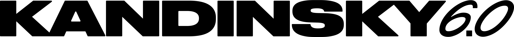
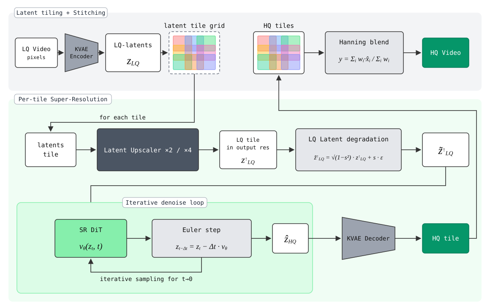
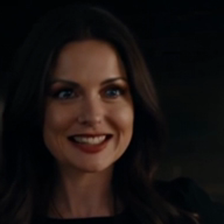
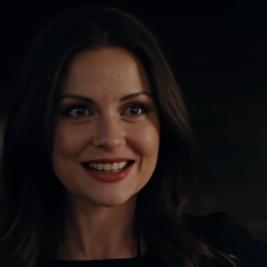
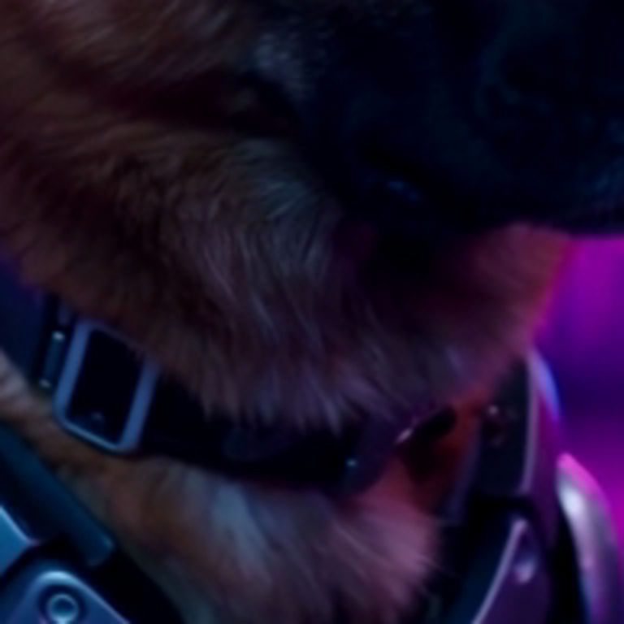
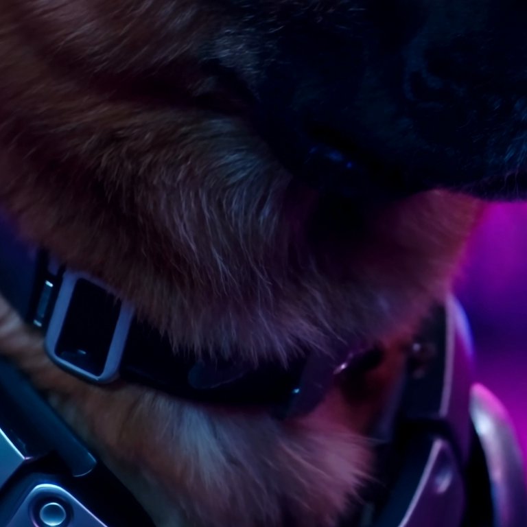

<div align="center">
<picture>
  <source media="(prefers-color-scheme: dark)" srcset="assets/Kandinsky_LOGO_6_Horizontal_white.png">
  
</picture>
</div>

<div align="center">

<a href="https://huggingface.co/spaces/kandinskylab/Kandinsky-6.0-VSR-Demo"></a>

<a href="https://huggingface.co/kandinskylab/Kandinsky-6.0-VSR-distilled2steps-5s-Diffusers"></a>
<a href="https://huggingface.co/kandinskylab/Kandinsky-6.0-VSR-5s-Diffusers"></a>

</div>

# Kandinsky 6.0 Video Super-Resolution

Tiled video super-resolution for the **Kandinsky 6.0 Video** pipeline: **KVAE encode → latent upscaler → DiT (tiled) → KVAE decode**, x2 / x4 / x2.25 upscale of 5-second clips. Shipped as the `kandinsky-6-video-sr` package (import name `kandinsky_sr`) with the `kandy-sr` CLI; the [Kandinsky 6](https://github.com/kandinskylab/kandinsky-6) pipeline embeds it for generation-then-SR.

## 🚀 Getting Started

### 1. Install

```bash
pip install "kandinsky-6-video-sr @ git+https://github.com/kandinskylab/kandinsky-6-sr"
```

With the MagiCompiler KVAE backend (`vae_backend: magi`):

```bash
pip install "kandinsky-6-video-sr[magi] @ git+https://github.com/kandinskylab/kandinsky-6-sr"
```

### 2. Setup config

```yaml
# sr_config.yaml
sr:
  checkpoint_path: kandinskylab/Kandinsky-6.0-VSR-distilled2steps-5s-Diffusers
  resolution_scale: 2      # 2, 4 or 2.25
  device: cuda:0
```

The models are published as Diffusers bundles: one repository holds the SR DiT, the KVAE and the x2 / x4 latent upscalers, and `checkpoint_path` alone loads all three (downloaded into the HF cache on first use). Two bundles are available — the 2-step π-Flow distilled [Kandinsky-6.0-VSR-distilled2steps-5s-Diffusers](https://huggingface.co/kandinskylab/Kandinsky-6.0-VSR-distilled2steps-5s-Diffusers) and its flow-matching teacher [Kandinsky-6.0-VSR-5s-Diffusers](https://huggingface.co/kandinskylab/Kandinsky-6.0-VSR-5s-Diffusers); a local copy of a bundle works the same way (`checkpoint_path: /path/to/bundle`).

`vae_path` and `latent_upscaler_config` are only needed to take those models from somewhere else, e.g. `vae_path: kandinskylab/Kandinsky-6.0-VSR-5s-Diffusers/vae`. All parameters: [Config parameters](#config-parameters-sr-section).

### 3. Run Inference

```bash
kandy-sr from-video --config sr_config.yaml --input lq.mp4 --output-dir outputs

# any config value can be overridden from the CLI, e.g. the GPU and x4 upscale
kandy-sr from-video --config sr_config.yaml --input lq.mp4 --output-dir outputs \
    --device "cuda:0" --resolution-scale 4 --vae-backend magi
```

`--config` can be replaced by the `KANDY_SR_CONFIG` env var; explicit CLI options override the YAML (`kandy-sr from-video --help` lists them).

> **Note** (`vae_backend: magi`): if the run fails with `RuntimeError: CUDA driver error: invalid argument`, the MagiCompiler cache holds artifacts built for another GPU / torch build — point it at a fresh directory: `MAGI_COMPILE_CACHE_ROOT_DIR=/path/to/new_cache_dir kandy-sr ...`.

From Python (see `notebooks/sr_inference_example.ipynb`):

```python
from kandinsky_sr.pipeline.factory import load_sr_pipeline

sr_pipeline = load_sr_pipeline("sr_config.yaml", device="cuda:0", force=True)
result = sr_pipeline(video=frames_tchw_uint8, source_video="lq.mp4", save_path="outputs/sr.mp4")
```

Several equal-shaped clips go through in one call: pass `video` as a `[B, T, 3, H, W]` tensor (or a list of clips) and `save_path` / `source_video` as lists — see `notebooks/sr_batch_inference_example.ipynb`.

`load_sr_pipeline` also accepts an `SRConfig`; pass `offload=` (any `kandinsky_sr.core.utils.offload.OffloadHandle`) to let the host pipeline manage module residency — the DiT, KVAE and latent upscaler are registered as `dit`, `vae`, `latent_upscaler`.

## ComfyUI

The `ComfyUI-K6-VSR/` folder is a ComfyUI custom-node pack over this package: **Kandinsky 6 VSR Load Model** and **Kandinsky 6 VSR Upscale** nodes plus an example workflow built on the core video nodes (Load Video → Get Video Components → Upscale → Create Video → Save Video). Installation and usage: [ComfyUI-K6-VSR/README.md](ComfyUI-K6-VSR/README.md).

## Inference Time on H100

Measured with the 2-step distilled SR DiT ([Kandinsky-6.0-VSR-distilled2steps-5s-Diffusers](https://huggingface.co/kandinskylab/Kandinsky-6.0-VSR-distilled2steps-5s-Diffusers)) on a 5-second (121 frames, 24 fps) 768×512 clip, torch 2.10.0+cu128, with the KVAE decode precompiled at load (`kandy-sr` default) and `--warmup`. 
The time covers the SR pass itself (whole-clip KVAE encode, per-tile latent upscale, DiT and KVAE decode, and Hanning-blend stitching), excluding model load, warmup, video reading and saving.

| Input (W×H) | Scale | Output (W×H) | Tiles | Time |
|:---:|:---:|:---:|:---:|:---:|
| 768×512 | ×2 | 1536×1024 | 9 | 41 s |
| 768×512 | ×4 | 3072×2048 | 25 | 118 s |

## Config parameters (`sr:` section)

<details>
<summary>Full parameter reference</summary>

Schema: `src/kandinsky_sr/pipeline/config.py::SRConfig`. The same section works in a standalone SR YAML and inside a full k6 pipeline config.

| Parameter | Default | Description |
|---|---|---|
| `checkpoint_path` | — (required) | The SR DiT: a `Kandinsky6SRPipeline` Diffusers bundle — a Hugging Face repo id (e.g. [`kandinskylab/Kandinsky-6.0-VSR-distilled2steps-5s-Diffusers`](https://huggingface.co/kandinskylab/Kandinsky-6.0-VSR-distilled2steps-5s-Diffusers)) or a local copy of it — whose `transformer/` and `scheduler/` folders are read. A native DiT checkpoint works too: a dir with `model.safetensors` + `config.yaml`, a `.safetensors`/`.pt` file, or a sharded `model/` dir. |
| `vae_path` | the bundle's `vae/` | Video KVAE. Unset = the VAE of the `checkpoint_path` bundle. Otherwise a bundle (repo id or local dir), its component (`<repo>/vae` or a local `vae/` dir), or a native KVAE: a sidecar pair (`{prefix}.yaml` + `{prefix}.safetensors` / `{prefix}.ckpt`, given as the prefix or its directory) or the `config.json` + `model.safetensors` layout of the public KVAE 2.0 checkouts. Required with a native DiT checkpoint. |
| `latent_upscaler_config` | the bundle's `latent_upscaler/` | Latent upscalers (x2 and x4). Unset = the bank of the `checkpoint_path` bundle. Otherwise a bundle (repo id or local dir), its component (`<repo>/latent_upscaler` or a local `latent_upscaler/` dir), or a native LU bank YAML (architectures + checkpoints; relative `checkpoint:` entries resolve against the YAML's directory) or the directory holding it. `"none"` disables the LU (pixel path). Required with a native DiT checkpoint. |
| `resolution_scale` | `2.25` | Total upscale factor: `2`, `4`, or `2.25` (x1.125 pixel pre-upscale + x2 tiling). |
| `num_steps` | `5` | Denoising grid points per tile (N points = N−1 steps). Ignored by π-Flow-distilled checkpoints (they run at the trained nfe). |
| `vae_backend` | `torch` | KVAE compilation backend: `torch` (torch.compile) or `magi` (MagiCompiler, needs the `magi` extra). |
| `device` | `cuda:0` | CUDA device the pipeline runs on; `--device` overrides. |
| `seed` | `42` | Noise seed (per-tile-chunk deterministic). |
| `tiles_batch_size` | `1` | Tiles per DiT call; larger = better GPU utilisation, more peak memory. |
| `overlap` | `0.20` | Minimum overlap between neighbouring tiles as a fraction of the tile size; the grid uses the fewest tiles with uniform overlap ≥ this. |
| `lu_load_scales` | `null` (all) | Bank entries (by `target_scale`, e.g. `["2x"]`) loaded eagerly at startup; unlisted entries lazy-load on first use. |
| `target_resolution` | `null` (raw) | Downscale the SR result to a delivery tier (`hd` / `fullhd` / `2k`) or an explicit `WxH`. |
| `target_resize_mode` | `fit` | `fit` preserves aspect exactly; `exact` resizes to the precise bucket dimensions. |
| `instruct_type_override` | `noise` | Post-load DiT `instruct_type` override (`noise` starts denoising from the LQ latent); `null` keeps the checkpoint config's value. |
| `dit_overrides` | `null` | Extra `KEY: VALUE` attribute overrides applied to the loaded DiT via `setattr`. |
| `enabled`, `mode`, `kvae_bridge`, `source_vae_path` | — | k6-embedded route only (`kandy generate` with SR); ignored by the standalone `kandy-sr` CLI. |

Model-contract values (trained fps/frame budget, base resolutions, delivery-tier tables) are intentionally **not** configurable — they live in `constants.py`.

</details>

## Inference Pipeline

<div align="center">

</div>

The input video is encoded once with the KVAE-3D-2.0-t4s16 video tokenizer and the LQ latent is split into an overlapping tile grid. Each tile is upscaled by the learned latent upscaler (×2 / ×4), mixed with variance-preserving noise (the LQ-latent degradation the model was trained on) and used as the starting point of the denoising loop — the SR DiT predicts the velocity and an Euler step moves the latent towards t→0 (the distilled checkpoint needs 2 evaluations, the flow-matching one a few more). Every denoised tile is KVAE-decoded, and the HQ tiles are stitched back with Hanning-window blending.

Any input resolution works. The latent path needs the clip on the KVAE stride (16 px) and at least one tile wide and high, so the pipeline pads it bottom/right with a mirrored strip before the encode and crops the stitched result back to exactly `source × scale` — callers never resize or align their videos.

## Examples

Outputs of the 2-step distilled SR DiT ([Kandinsky-6.0-VSR-distilled2steps-5s-Diffusers](https://huggingface.co/kandinskylab/Kandinsky-6.0-VSR-distilled2steps-5s-Diffusers)) on 768×512 clips generated by Kandinsky 6.0 Video. The second row zooms into the same region (the LR crop is upscaled bicubically to the SR size).

| LR input (768×512) | SR ×2 output (1536×1024) |
|:---:|:---:|
| <video src="https://github.com/user-attachments/assets/db2e8148-08be-4834-9c89-9f16b4e14e4c" controls width="480"></video> | <video src="https://github.com/user-attachments/assets/0aa4eaf5-0bf8-4f88-80db-054f675c62d5" controls width="480"></video> |
|  |  |
| *crop, bicubic ×2* | *crop, SR ×2* |

| LR input (768×512) | SR ×4 output (3072×2048) |
|:---:|:---:|
| <video src="https://github.com/user-attachments/assets/337834ed-60c8-4f39-ad11-3204454017a7" controls width="480"></video> | <video src="https://github.com/user-attachments/assets/736340d3-319d-4ba4-bd2e-df58d0c38dce" controls width="480"></video> |
|  |  |
| *crop, bicubic ×4* | *crop, SR ×4* |

## License

This project is licensed under the [MIT License](LICENSE). Diffusers export templates retain their Apache-2.0 notices; see [LICENSE-APACHE](LICENSE-APACHE).
